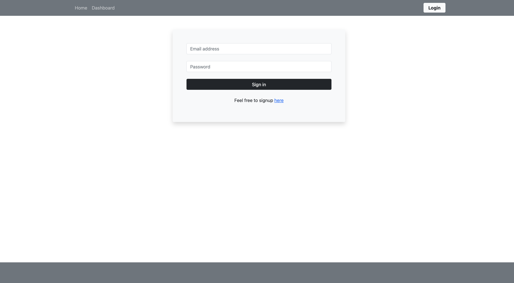

# 🗒 Tech Blog
This is a blog where developer can share anything they want that is related with tech, the user will be available to post and comment other posts, this is a site built using the MVC framework.

## 🛠 Tools

- Expresss
- Connect-session-sequelize
- Express-handlebars
- Express-session
- Mysql2
- Sequelize
- Dotenv
- Bcrypt

## 🚀 Deployment
https://tech-blog-johan.herokuapp.com

## 📸 Screen Shots

## Author

- [@Johanh0](https://www.github.com/johanh0)

## Support or contact

For support or if you wish contact me please, email me to [johanherrera20000@gmail.com](mailto:johanherrera20000@gmail.com).